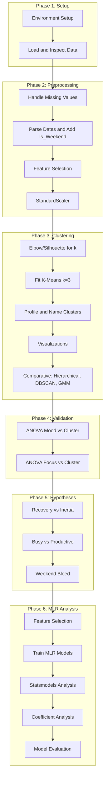

# Work-Study-Life Profile: Step-by-Step Execution Plan

## Phase 1: Environment and Data Setup

### Step 1.1: Environment Setup

- Create conda environment via [conda.txt](conda.txt): `conda create --name quantified_env python=3.9`
- Install dependencies: `pandas`, `numpy`, `matplotlib`, `seaborn`, `scikit-learn`, `scipy`, `jupyter`

### Step 1.2: Load and Inspect Data

- Load [data/Data Science Dataset - DATABASE.csv](data/Data Science Dataset - DATABASE.csv) in Jupyter
- Inspect: `df.info()`, `df.describe()`, `df.isnull().sum()` to understand structure, ranges, and missingness
- Note: Dataset has 74 rows with columns: Date, Day of the Week, Sleep_Hours, Work_Hours, Study_Hours, Chore_Time_Mins, Distraction_Time_Mins, Travel Time (Hours), Mode of Transport, Music_Time_Hours, Main_Music_Genre, Tasks_Completed, Mood_Rating, Focus_Rating, Notes

---

## Phase 2: Data Cleaning and Preprocessing

### Step 2.1: Handle Missing Values

- Drop rows with missing dates (per methodology)
- Impute missing numeric values with 0 (per methodology)
- Optionally: flag and log imputed values for transparency

### Step 2.2: Parse and Validate Dates

- Parse `Date` column to datetime
- Validate `Day of the Week` against computed weekday from `Date` (some entries may be misaligned)
- Add a derived `Is_Weekend` column (Saturday/Sunday) for the "Weekend Bleed" hypothesis

### Step 2.3: Handle Categorical Variables

- **Mode of Transport** and **Main_Music_Genre** are multi-valued strings; decide:
  - Option A: One-hot encode for clustering (if these are input features)
  - Option B: Exclude from clustering, use only for exploratory analysis
- Per methodology, clustering uses: Sleep_Hours, Travel Time, Work_Hours, Study_Hours, behaviors (Chore_Time_Mins, Distraction_Time_Mins, Tasks_Completed)

### Step 2.4: Feature Selection for Clustering

- **Inputs:** Sleep_Hours, Music_Time_Hours, Travel Time (Hours)
- **Behaviors:** Work_Hours, Study_Hours, Chore_Time_Mins, Distraction_Time_Mins, Tasks_Completed
- **Targets (excluded from clustering):** Mood_Rating, Focus_Rating
- Exclude Date, Day of the Week, Mode of Transport, Main_Music_Genre, Notes from clustering (unless one-hot encoded)

### Step 2.5: Scaling

- Apply `StandardScaler` (Z-score normalization) to clustering features
- Store scaler for later use (e.g., inverse transform for interpretability)

---

## Phase 3: K-Means Clustering

### Step 3.1: Elbow Method / Silhouette Analysis

- Use Elbow Method and/or Silhouette Score to choose k (methodology suggests k=3)
- Compare k=2,3,4,5 to validate k=3 or refine

### Step 3.2: Fit K-Means (k=3)

- Fit K-Means on scaled features
- Assign cluster labels to each day

### Step 3.3: Cluster Profiling

- Compute mean and std of each feature per cluster
- Name clusters based on characteristics (per methodology):
  - **Cluster 0:** "The Commuter Grind" (high Travel Time, moderate Work, low Study)
  - **Cluster 1:** "The Deep Work / WFH Day" (zero/low Travel, high Work, high Study)
  - **Cluster 2:** "The Distracted Recovery" (high Distraction, high Sleep, low Tasks_Completed)

### Step 3.4: Visualizations

- PCA (2D) or t-SNE scatter plot colored by cluster
- Box plots of key features by cluster
- Heatmap of cluster centroids (scaled back if possible for interpretability)

### Step 3.5: Comparative Clustering Analysis

Run alternative algorithms on the same scaled features and compare:

- **K-Means:** Fast, interpretable centroids; assumes spherical clusters, needs k (primary method)
- **Hierarchical (Agglomerative):** No k needed upfront, dendrogram for structure; slower, cut height choice (use Ward linkage)
- **DBSCAN:** Handles outliers, arbitrary shapes; needs eps/min_samples tuning (may label many as noise)
- **Gaussian Mixture (GMM):** Soft assignments, elliptical clusters; more complex, less interpretable (good for overlap)

**Comparison framework:**

- Fix k=3 for K-Means, Hierarchical, GMM to ensure fair comparison
- For DBSCAN: tune eps and min_samples to get ~3 clusters, or report noise proportion
- Compute internal metrics: Silhouette Score, Calinski-Harabasz Index
- Run ANOVA (Mood, Focus) for each method's labels; compare F-statistics and p-values
- Build a comparison table: Algorithm | Silhouette | CH Index | ANOVA Mood p-value | ANOVA Focus p-value
- Visualize: side-by-side PCA/t-SNE plots colored by each algorithm's labels
- Discuss which method best separates behavioral profiles and why

---

## Phase 4: Statistical Validation (ANOVA)

### Step 4.1: Mood vs. Cluster

- One-way ANOVA: `Mood_Rating` by cluster label
- Report F-statistic and p-value
- Interpret: p < 0.05 indicates cluster type significantly affects mood

### Step 4.2: Focus vs. Cluster

- One-way ANOVA: `Focus_Rating` by cluster label
- Report F-statistic and p-value
- Interpret: p < 0.05 indicates cluster type significantly affects focus

### Step 4.3: Post-hoc Tests (if ANOVA significant)

- Tukey HSD or pairwise t-tests to identify which cluster pairs differ

---

## Phase 5: Hypothesis Testing

### Step 5.1: "Recovery vs. Inertia" Hypothesis

- Define "Rest Profiles" (e.g., Cluster 2) and "Deep Work" (e.g., Cluster 1)
- For each day in Rest Profile, check next day's cluster:
  - Count transitions: Rest → Deep Work vs. Rest → Low-Performance
- Use chi-square or proportion tests to assess if recovery precedes deep work more than inertia

### Step 5.2: "Busy vs. Productive" Distinction

- Compute ratio: `Work_Hours / (Distraction_Time_Mins/60)` or similar
- Check if clusters naturally separate High-Volume/Low-Focus (Busywork) from High-Volume/High-Focus (Flow State)
- Visualize: Work_Hours vs. Distraction_Time_Mins, colored by cluster and Focus_Rating

### Step 5.3: "Weekend Bleed" Effect

- Crosstab: cluster vs. `Is_Weekend`
- Check if Work/Study profiles appear on weekends
- Correlate Weekend + Work/Study intrusion with Low Mood (e.g., regression or stratified ANOVA)

---

## Phase 6: Multiple Linear Regression (MLR) Analysis

### Step 6.1: Feature Selection for MLR

- Select features: Sleep_Hours, Music_Time_Hours, Travel Time (Hours), Work_Hours, Study_Hours, Chore_Time_Mins, Distraction_Time_Mins, Tasks_Completed
- Targets: Mood_Rating and Focus_Rating
- Split data into training (80%) and test (20%) sets, maintaining temporal order

### Step 6.2: Train MLR Models

- Build MLR model for Mood_Rating prediction
- Build MLR model for Focus_Rating prediction
- Use sklearn's LinearRegression for initial model fitting
- Calculate performance metrics: RMSE, MAE, R²

### Step 6.3: Statistical Analysis using Statsmodels

- Use statsmodels.api.OLS for detailed statistical analysis
- Extract coefficients, p-values, confidence intervals
- Identify significant predictors (p < 0.05)
- Calculate Adjusted R² for model comparison
- Generate full regression summary tables

### Step 6.4: Coefficient Analysis and Interpretation

- Visualize coefficients using bar plots (positive vs negative effects)
- Identify which factors most strongly influence Mood_Rating and Focus_Rating
- Interpret coefficient magnitudes and directions
- Compare significant predictors between Mood and Focus models

### Step 6.5: Model Evaluation and Visualization

- Plot predicted vs actual values (scatter plots)
- Visualize residuals if needed
- Compare training vs test performance
- Document model performance metrics

### Step 6.6: Results Compilation

- Summary table of MLR model performance
- Table of significant predictors with coefficients and p-values
- Interpretation of findings
- Integration with clustering results

---

## Phase 7: Results and Documentation

### Step 7.1: Compile All Results

- Summary table of cluster characteristics
- ANOVA results table
- Hypothesis test outcomes
- MLR model results and interpretations
- Figures suitable for [documentation/CCIT-CPT-001 ACM Paper Format.docx](documentation/CCIT-CPT-001 ACM Paper Format.docx)

---

## Suggested File Structure

```
Final Proj Work Life/
├── data/
│   └── Data Science Dataset - DATABASE.csv
├── 1data_cleaning.ipynb         # Phase 1–2: Load, clean, preprocess
├── 2clustering_analysis.ipynb   # Phase 3–4: K-Means, comparative (Hierarchical, DBSCAN, GMM), ANOVA
├── 3hypothesis_testing.ipynb    # Phase 5: Recovery vs. Inertia, Busy vs. Productive, Weekend Bleed
├── 5mlr_analysis.ipynb          # Phase 6: Multiple Linear Regression (MLR) for Mood and Focus prediction
├── 4predictive_model.ipynb      # (Optional) Phase 6.2: Random Forest for comparison
└── project-description.md
```

---

## Mermaid: High-Level Workflow




