# Work-Study-Life Profile: Step-by-Step Execution Plan

## Overview

This plan focuses on **data science concepts** and **dataset analysis** rather than machine learning modeling. The emphasis is on:

- Exploratory Data Analysis (EDA)
- Descriptive Statistics
- Statistical Tests (ANOVA, Chi-square, Correlation)
- Pattern Identification
- Hypothesis Testing
- Data Interpretation

## Phase 1: Environment and Data Setup

### Step 1.1: Environment Setup

- Create conda environment via [conda.txt](conda.txt): `conda create --name quantified_env python=3.9`
- Install dependencies: `pandas`, `numpy`, `matplotlib`, `seaborn`, `scikit-learn`, `scipy`, `jupyter`, `statsmodels`

### Step 1.2: Load and Inspect Data

- Load [data/Data Science Dataset - DATABASE.csv](data/Data Science Dataset - DATABASE.csv) in Jupyter
- Inspect: `df.info()`, `df.describe()`, `df.isnull().sum()` to understand structure, ranges, and missingness
- Note: Dataset has 81 rows with columns: Date, Day of the Week, Sleep_Hours, Work_Hours, Study_Hours, Chore_Time_Mins, Distraction_Time_Mins, Travel Time (Hours), Mode of Transport, Music_Time_Hours, Main_Music_Genre, Tasks_Completed, Mood_Rating, Focus_Rating, Notes

---

## Phase 2: Data Cleaning and Preprocessing

### Step 2.1: Handle Missing Values

- Drop rows with missing dates (per methodology)
- Impute missing numeric values with 0 (per methodology)
- Flag and log imputed values for transparency
- Document data quality issues

### Step 2.2: Parse and Validate Dates

- Parse `Date` column to datetime
- Validate `Day of the Week` against computed weekday from `Date`
- Add derived `Is_Weekend` column (Saturday/Sunday) for the "Weekend Bleed" hypothesis
- Create time-series visualizations

### Step 2.3: Handle Categorical Variables

- **Mode of Transport** and **Main_Music_Genre**: One-hot encode for analysis
- Create frequency tables for categorical variables
- Visualize categorical distributions

### Step 2.4: Feature Selection for Analysis

- **Inputs:** Sleep_Hours, Music_Time_Hours, Travel Time (Hours)
- **Behaviors:** Work_Hours, Study_Hours, Chore_Time_Mins, Distraction_Time_Mins, Tasks_Completed
- **Targets:** Mood_Rating, Focus_Rating
- Document feature definitions and measurement units

### Step 2.5: Data Quality Assessment

- Identify outliers using box plots and IQR method
- Document outlier handling decisions
- Check for data consistency (e.g., impossible values)
- Create data quality report

### Step 2.6: Scaling (for Clustering Only)

- Apply `StandardScaler` (Z-score normalization) to clustering features
- Store scaler for later use
- Note: Scaling is only for distance-based clustering, not for statistical tests

---

## Phase 3: Exploratory Data Analysis (EDA)

### Step 3.1: Descriptive Statistics

- Calculate mean, median, mode, standard deviation, range for all numerical variables
- Create summary statistics table
- Identify distributions (normal, skewed, etc.)

### Step 3.2: Univariate Analysis

- Create histograms for all numerical variables
- Create box plots to identify outliers and distributions
- Analyze distributions: normal, skewed, bimodal, etc.
- Document key observations

### Step 3.3: Bivariate Analysis

- Create scatter plots for variable pairs
- Calculate correlation matrix
- Visualize correlation heatmap
- Identify strong correlations (|r| > 0.5)
- Document relationships

### Step 3.4: Time-Series Analysis

- Plot variables over time (line charts)
- Identify trends, cycles, patterns
- Analyze weekly patterns (weekday vs. weekend)
- Document temporal patterns

### Step 3.5: Categorical Analysis

- Create frequency tables for categorical variables
- Create bar charts for categorical distributions
- Analyze relationships between categorical and numerical variables

---

## Phase 4: Pattern Identification (Clustering as EDA)

### Step 4.1: Clustering as Exploratory Technique

**Purpose:** Use clustering to identify natural groupings in the data, not for prediction.

- Use Elbow Method and/or Silhouette Score to choose k
- Compare k=2,3,4,5 to validate k=3
- Document clustering as an exploratory technique, not a predictive model

### Step 4.2: Fit K-Means (k=3)

- Fit K-Means on scaled features
- Assign cluster labels to each day
- **Important:** Frame clustering as pattern discovery, not ML modeling

### Step 4.3: Cluster Profiling and Characterization

- Compute mean and std of each feature per cluster
- Create cluster comparison table
- Name clusters based on characteristics:
  - **Cluster 0:** "The Commuter Grind" (high Travel Time, moderate Work, low Study)
  - **Cluster 1:** "The Deep Work / WFH Day" (zero/low Travel, high Work, high Study)
  - **Cluster 2:** "The Distracted Recovery" (high Distraction, high Sleep, low Tasks_Completed)

### Step 4.4: Cluster Visualizations

- PCA (2D) or t-SNE scatter plot colored by cluster
- Box plots of key features by cluster
- Heatmap of cluster centroids (scaled back for interpretability)
- Bar charts comparing cluster characteristics

### Step 4.5: Comparative Clustering Analysis (Optional)

Run alternative algorithms for comparison (not required, but good for understanding):

- Hierarchical (Agglomerative): For comparison
- DBSCAN: For outlier detection
- Compare results, but emphasize K-Means as primary exploratory method

---

## Phase 5: Statistical Validation

### Step 5.1: ANOVA - Mood vs. Cluster

- One-way ANOVA: `Mood_Rating` by cluster label
- Report F-statistic, p-value, effect size
- Interpret: p < 0.05 indicates cluster type significantly affects mood
- If significant: Perform post-hoc tests (Tukey HSD)

### Step 5.2: ANOVA - Focus vs. Cluster

- One-way ANOVA: `Focus_Rating` by cluster label
- Report F-statistic, p-value, effect size
- Interpret: p < 0.05 indicates cluster type significantly affects focus
- If significant: Perform post-hoc tests (Tukey HSD)

### Step 5.3: Correlation Analysis

- Calculate correlations between all numerical variables
- Identify significant correlations (p < 0.05)
- Visualize correlation matrix
- Interpret relationships

### Step 5.4: Additional Statistical Tests

- T-tests: Compare means between groups (e.g., weekday vs. weekend)
- Chi-square tests: Analyze categorical relationships
- Document all test results with p-values and interpretations

---

## Phase 6: Hypothesis Testing

### Step 6.1: "Recovery vs. Inertia" Hypothesis

- Define "Rest Profiles" (Cluster 2) and "Deep Work" (Cluster 1)
- For each day in Rest Profile, check next day's cluster:
  - Count transitions: Rest → Deep Work vs. Rest → Low-Performance
- Use chi-square test to assess if recovery precedes deep work more than inertia
- Report: Observed frequencies, expected frequencies, chi-square statistic, p-value
- Interpret results

### Step 6.2: "Busy vs. Productive" Distinction

- Compute ratio: `Work_Hours / (Distraction_Time_Mins/60)` or similar
- Analyze if clusters naturally separate High-Volume/Low-Focus (Busywork) from High-Volume/High-Focus (Flow State)
- Visualize: Work_Hours vs. Distraction_Time_Mins, colored by cluster and Focus_Rating
- Use correlation analysis to examine relationships
- Interpret findings

### Step 6.3: "Weekend Bleed" Effect

- Create crosstabulation: cluster vs. `Is_Weekend`
- Check if Work/Study profiles appear on weekends
- Analyze association between Weekend + Work/Study patterns and Low Mood
- Use chi-square test or stratified analysis
- Visualize: Stacked bar charts, crosstabulation tables
- Interpret results

---

## Phase 7: Results Compilation and Documentation

### Step 7.1: Compile All Results

- Summary table of descriptive statistics
- Summary table of cluster characteristics
- ANOVA results table with F-statistics and p-values
- Correlation matrix
- Hypothesis test outcomes (chi-square, etc.)
- Key visualizations suitable for paper

### Step 7.2: Create Results Summary

- Document all findings
- Create tables and figures with proper captions
- Ensure all statistical tests are properly reported
- Link results to research questions

### Step 7.3: Data Interpretation

- Interpret all statistical findings
- Connect results to research questions
- Discuss patterns and relationships
- Prepare for Discussion section

---

## Suggested File Structure

```
Final Proj Work Life/
├── data/
│   ├── Data Science Dataset - DATABASE.csv
│   ├── cleaned_data.csv
│   ├── scaled_features.csv
│   ├── data_with_clusters.csv
│   └── metadata.json
├── 1data_cleaning.ipynb         # Phase 1–2: Load, clean, preprocess, EDA
├── 2clustering_analysis.ipynb   # Phase 3–4: Clustering (as EDA), ANOVA validation
├── 3hypothesis_testing.ipynb    # Phase 5: Recovery vs. Inertia, Busy vs. Productive, Weekend Bleed
├── project-description.md
└── README.md
```

**Note:** Files `4predictive_model.ipynb` and `5mlr_analysis.ipynb` are not part of the core analysis focus. They may be kept for reference but should not be emphasized in the main analysis.

---

## Key Principles

1. **Focus on Data Understanding**: Emphasize understanding patterns in the dataset rather than building predictive models.
2. **Statistical Analysis**: Use appropriate statistical tests (ANOVA, chi-square, correlation) to validate findings.
3. **Clustering as EDA**: Frame clustering as an exploratory technique to identify patterns, not as a machine learning model.
4. **Interpretation**: Always interpret statistical results in the context of the research questions.
5. **Documentation**: Document all steps, decisions, and findings clearly.

---

## Mermaid: High-Level Workflow

```mermaid
flowchart TD
    subgraph phase1 [Phase 1: Setup]
        A1[Environment Setup]
        A2[Load and Inspect Data]
    end

    subgraph phase2 [Phase 2: Preprocessing]
        B1[Handle Missing Values]
        B2[Parse Dates and Add Is_Weekend]
        B3[Data Quality Assessment]
        B4[Feature Selection]
        B5[Scaling for Clustering]
    end

    subgraph phase3 [Phase 3: EDA]
        C1[Descriptive Statistics]
        C2[Univariate Analysis]
        C3[Bivariate Analysis]
        C4[Time-Series Analysis]
        C5[Categorical Analysis]
    end

    subgraph phase4 [Phase 4: Pattern Identification]
        D1[Clustering as EDA]
        D2[Fit K-Means k=3]
        D3[Profile and Name Clusters]
        D4[Cluster Visualizations]
    end

    subgraph phase5 [Phase 5: Statistical Validation]
        E1[ANOVA Mood vs Cluster]
        E2[ANOVA Focus vs Cluster]
        E3[Correlation Analysis]
        E4[Additional Statistical Tests]
    end

    subgraph phase6 [Phase 6: Hypothesis Testing]
        F1[Recovery vs Inertia]
        F2[Busy vs Productive]
        F3[Weekend Bleed]
    end

    subgraph phase7 [Phase 7: Documentation]
        G1[Compile Results]
        G2[Create Summary Tables]
        G3[Data Interpretation]
    end

    A1 --> A2 --> B1 --> B2 --> B3 --> B4 --> B5 --> C1 --> C2 --> C3 --> C4 --> C5 --> D1 --> D2 --> D3 --> D4 --> E1 --> E2 --> E3 --> E4 --> F1 --> F2 --> F3 --> G1 --> G2 --> G3
```




---

## Alignment with IEEE Data Science Paper Guide

This plan aligns with the IEEE guide structure:

- **I. Introduction**: Research questions and objectives
- **II. Literature Review**: Related work (to be written)
- **III. Methodology**: Data collection, cleaning, statistical methods
- **IV. Results**: Descriptive stats, patterns, statistical test results
- **V. Discussion**: Interpretation, limitations, recommendations
- **VI. Conclusion**: Key findings and insights

The focus is on **data science concepts** (EDA, statistics, pattern identification) rather than machine learning modeling.